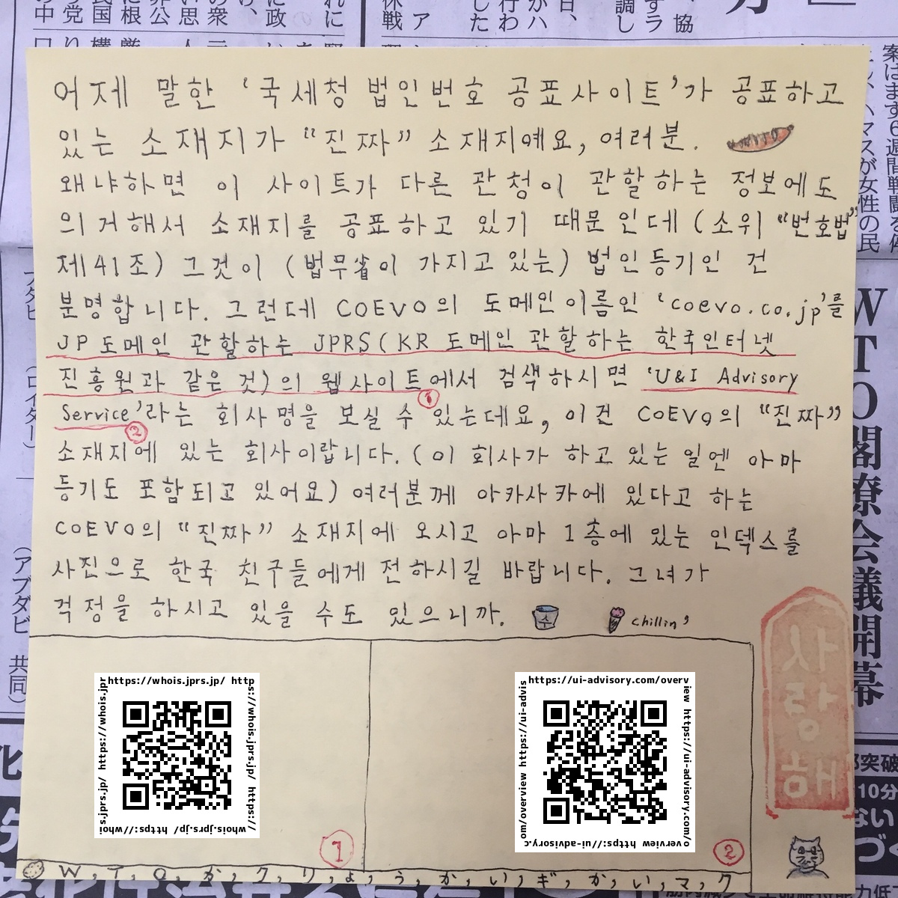

# tt-pingpong

## :ping_pong: Make me cry (T.T) by winning this *Touki-Takkyu* game, a Table Tennis in which the server is always me and you shoot a [*Certificate of Registered Matters*](https://business-japan.jp/2019/04/28/japan-certificate-of-registered-matters-for-companies/) of a certain company instead of a ball into my mailbox. 

### Ordinary companies vs. COEVO K. K. 
- https://github.com/anissatta/tt-pingpong/tree/main/game-in-game

*私は仮にここで虚偽の申告をしたとしても、インターネットを介した皆様同士のネットワークによってそれが筒抜けになり、ただちに皆様の力によって私の日々の生活が困難になることを理解した上でこれを公開しています。登記事項証明書の原本を私に直接提示するなどして私が虚偽の申告をしたと証明することができた方は私に対して殴打等の危害を加えても構いませんし、私はそれを甘受し警察への通報等を行わないことをここに誓います。* 

:new: 皆様は「国税庁法人番号公表サイト」に出てくる住所が法人の本店等の所在地ではなく、何か別のものだとお考えになったかも知れません。ただこのサイトが開設される上で根拠となったと考えられる法律がありそれは一般に「番号法」と呼ばれているものです。(正確には「行政手続における特定の個人を識別するための番号の利用等に関する法律」)これの第三十九条第四項には「国税庁長官は、政令で定めるところにより、第一項又は第二項の規定により法人番号の指定を受けた者（以下「法人番号保有者」という。）の商号又は名称、本店又は主たる事務所の所在地及び法人番号を公表するものとする。ただし、人格のない社団等については、あらかじめ、その代表者又は管理人の同意を得なければならない」とありますから、「国税庁法人番号公表サイト」が公表している住所が「本店又は主たる事務所の所在地」であることが前提知識なしでも理解出来るのです。もしまだ疑われているなら皆様がお勤めになっている会社等をこのサイトで検索してみて下さい。

**PS:** このことは「国税庁法人番号公表サイト」の「よくある質問」にも書かれています。

*Q. 法人の電話番号、代表者の氏名・住所を知りたいのですが、調べることはできますか。* 

*A. 国税庁法人番号公表サイト（以下「公表サイト」といいます。）では、番号法に基づき、法人番号の指定を受けた者の基本３情報（１　商号又は名称、２　本店又は主たる事務所の所在地、３　法人番号）を公表しております。したがって、公表サイトでは、基本３情報以外の情報である法人の電話番号、代表者の氏名・住所を調べることはできません。* 

https://www.houjin-bangou.nta.go.jp/shitsumon/shosai.html?selQaId=00098

**ANYONE can play this game! 下記は「登記・供託オンライン申請システム」のアカウント作成画面をコピーしたものです。 ご覧になれば分かる通り本システムにアカウントを作成して登記事項証明書の郵送依頼を行うことは誰でも簡単に出来ることなのですね。 またこれは想像ですが、CoEvo株式会社の管轄登記所(東京)へ行けば当日中に登記事項証明書が発行されるかと思います。大阪法務局等の窓口で申請した場合の所要時間についてはよく分かりません。**
- 

- 
- 
- 

### スコアボード

:shinto_shrine: **1** - **0** :people_holding_hands: 

### ゲーム２
- 期限: 2024. 3. 12
- ボーナス: 道頓堀で寒中水泳 + 着替えずに大阪駅まで歩く
- サーブ: 

### ゲーム１
- [Result](https://github.com/anissatta/tt-pingpong/tree/main/game01)
- 期限: 2024. 2. 29
- ボーナス: 道頓堀で寒中水泳
- サーブ: 
