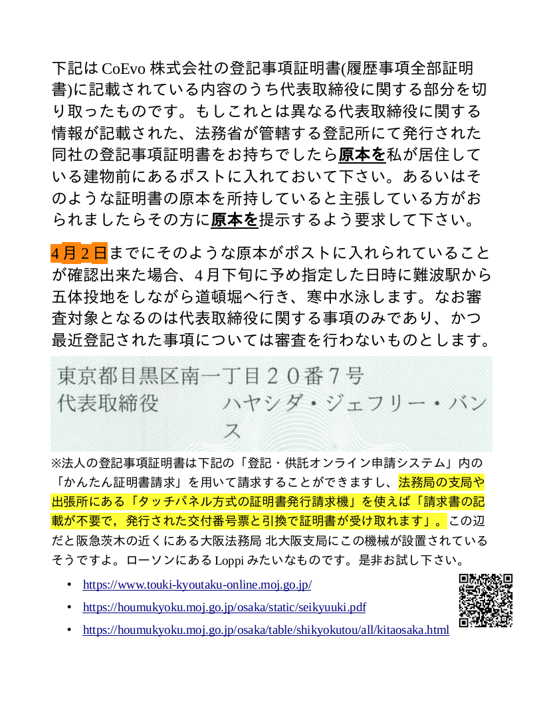

# tt-pingpong

## :ping_pong: Make me cry (T.T) by winning this *Touki-Takkyu* game, a Table Tennis in which the server is always me and you shoot a [*Certificate of Registered Matters*](https://business-japan.jp/2019/04/28/japan-certificate-of-registered-matters-for-companies/) of a certain company instead of a ball into my mailbox. 

### Ordinary companies vs. COEVO K. K. 
- https://github.com/anissatta/tt-pingpong/tree/main/game-in-game

*私は仮にここで虚偽の申告をしたとしても、インターネットを介した皆様同士のネットワークによってそれが筒抜けになり、ただちに皆様の力によって私の日々の生活が困難になることを理解した上でこれを公開しています。登記事項証明書の原本を私に直接提示するなどして私が虚偽の申告をしたと証明することができた方は私に対して殴打等の危害を加えても構いませんし、私はそれを甘受し警察への通報等を行わないことをここに誓います。* 

- **ANYONE can play this game! 下記は「登記・供託オンライン申請システム」のアカウント作成画面をコピーしたものです。 ご覧になれば分かる通り本システムにアカウントを作成して登記事項証明書の郵送依頼を行うことは誰でも簡単に出来ることなのですね。**
  - 
- また各地の法務局の支局や出張所にある「タッチパネル方式の証明書発行請求機」を使えば「請求書の記載が不要で，発行された交付番号票と引換で証明書が受け取れます」。この辺だと阪急茨木の近くにある大阪法務局 北大阪支局にこの機械が設置されているそうですよ。ローソンにあるLoppiみたいなものです。是非お試し下さい。
  - [証明書発行請求機について](https://houmukyoku.moj.go.jp/osaka/static/seikyuuki.pdf)
  - [大阪法務局 北大阪支局](https://houmukyoku.moj.go.jp/osaka/table/shikyokutou/all/kitaosaka.html)

- **UPDATE:** You can order a Certificate of Registered Matters of COEVO K. K. at any branch of Legal Affairs Bureau in Japan.  
- 
- 
- 
- 
- 

### スコアボード

:shinto_shrine: **2** - **0** :people_holding_hands: 

### ゲーム３
- 期限: 2024. 4. 2
- ボーナス: 難波駅から五体投地をしながら道頓堀へ向かい、寒中水泳をする
- サーブ: 

### ゲーム２
- [Result](https://github.com/anissatta/tt-pingpong/tree/main/game02)
- 期限: 2024. 3. 12
- ボーナス: 道頓堀で寒中水泳 + 着替えずに大阪駅まで歩く
- サーブ: 

### ゲーム１
- [Result](https://github.com/anissatta/tt-pingpong/tree/main/game01)
- 期限: 2024. 2. 29
- ボーナス: 道頓堀で寒中水泳
- サーブ: 
