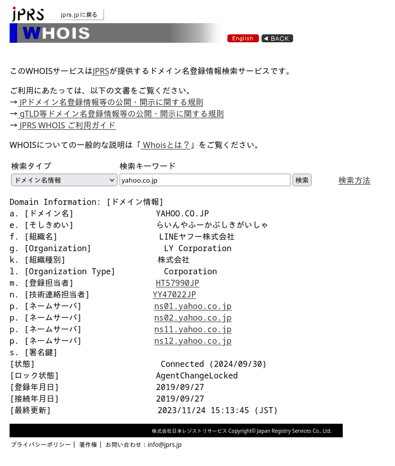
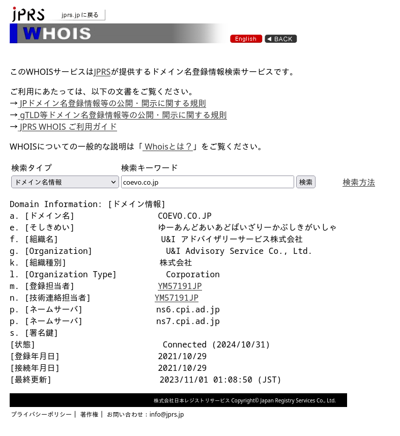
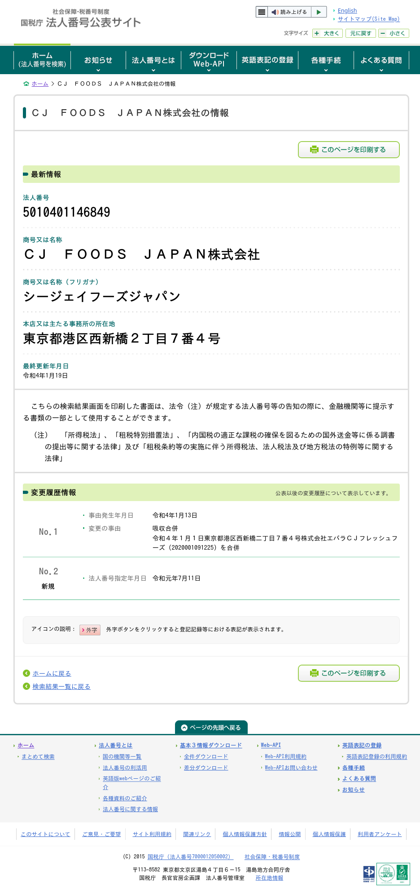
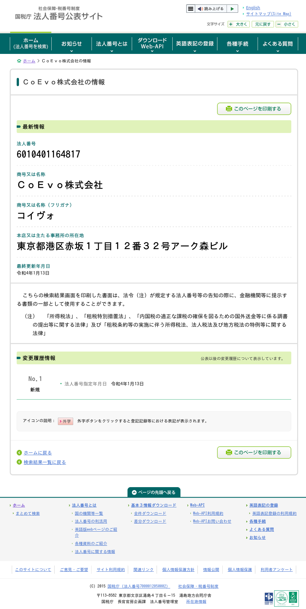
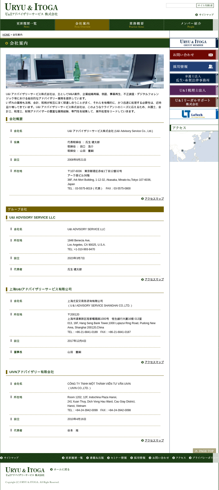

# Ordinary companies vs. COEVO K. K. 

**NOTE:** Of course, NTA's *Houjin-bangou Ko-hyo Site* tells you the accurate address of HQ of an organization, as declared in the article 58 of *Act on the Use of Numbers to Identify a Specific Individual in Administrative Procedures (行政手続における特定の個人を識別するための番号の利用等に関する法律):* 

> *The Commissioner of the National Tax Agency must, pursuant to the provisions of Cabinet Orders, make public the trade name or name, the location of the head office or principal office, and the Corporation Number of a person that has been designated a Corporation Number (hereinafter referred to as a "Corporation Number Holder") pursuant to the provisions of paragraphs (1) and (2); provided, however, that with regard to Unincorporated Associations, etc., the Commissioner of the National Tax Agency must in advance obtain the consent of its representative or administrator.* 
> https://www.japaneselawtranslation.go.jp/en/laws/view/2755

### 1. WHOIS the domain name registrants for these companies? 
- [JPRS (Japan Registry Services)](https://en.wikipedia.org/wiki/Japan_Registry_Services) manages the .jp [TLD (top-level domain),](https://en.wikipedia.org/wiki/Top-level_domain) which COEVO uses for its domain name.  It also provides a service with which you can look up their [WHOIS](https://en.wikipedia.org/wiki/WHOIS) database online.  So let us see what it says for ordinary companies in Japan and our COEVO K. K.:
  - https://whois.jprs.jp/

##### 1-1. Jinro Inc. 
- 
  - The name of organization is registered correctly as *JINRO INC.*  Fuiyoh!  I love it Jinro!  

##### 1-2. LY Corporation (LINEヤフー株式会社) 
- 
  - Correct!  

##### 1-3. COEVO K. K. 
- 
  - Hey, what the hell is this *U&I Advisory Service Co., Ltd.* which is registered in the record for COEVO K. K.?  Haiyaa...  

### 2. Where are the HQ of these companies? 
- In Japan, every company has a duty to register information about itself, including its headquarters address, etc., and some of the information can be viewed via [NTA's](https://en.wikipedia.org/wiki/National_Tax_Agency) *Houjin-bangou Ko-hyo Site.*  So let us see what it says about ordinary companies in Japan and our COEVO K. K.:
  - https://www.houjin-bangou.nta.go.jp/

##### 2-1. CJ Foods Japan 
- https://www.houjin-bangou.nta.go.jp/henkorireki-johoto.html?selHouzinNo=5010401146849
- 
  - It has registered the address correctly as *東京都港区西新橋２丁目７番４号.*  Fuiyoh!  I buy your products!

##### 2-2. COEVO K. K. 
- https://www.houjin-bangou.nta.go.jp/henkorireki-johoto.html?selHouzinNo=6010401164817
- 
  - No!  It (*東京都港区赤坂１丁目１２番３２号アーク森ビル*) isn't its address of the HQ it states on [its website!](https://www.coevo.co.jp/)  Haiyaa...  You should have registered *東京都港区愛宕1丁目1-1* as you state on https://www.coevo.co.jp/ instead of this...  And this is...
- 
  - This is the address of *U&I Advisory Service Co., Ltd.* which I mentioned above!  Haiyaa... :disappointed: 
