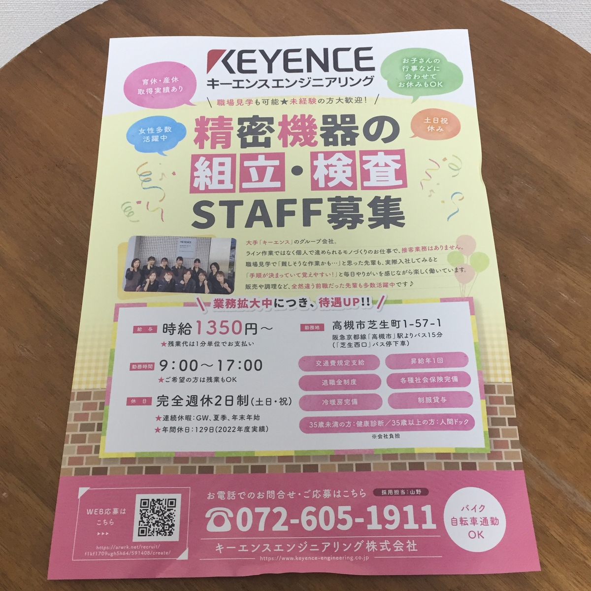

# ゲーム３

*私は仮にここで虚偽の申告をしたとしても、インターネットを介した皆様同士のネットワークによってそれが筒抜けになり、ただちに皆様の力によって私の日々の生活が困難になることを理解した上でこれを公開しています。登記事項証明書の原本を私に直接提示するなどして私が虚偽の申告をしたと証明することができた方は私に対して殴打等の危害を加えても構いませんし、私はそれを甘受し警察への通報等を行わないことをここに誓います。* 

### :shinto_shrine: サーブ
- 

### 中間発表 (2024. 3. 26) 
- 
  - 中身はCoEvo株式会社の登記事項証明書2通でしたがこれはこちらから「アタック」する場合に備えて請求していたものです。
    - 
    - 
    - 
    - 
- 

### 中間発表 (2024. 3. 25) 
- 
- 
- 
- 
  - 中身は実家から送ってもらったレインコートでした。
    - 
- 
- 
- 
- 
- 
- 
- 
- 
- 
- 
- 

### 中間発表 (2024. 3. 18) 
- 
- 
- 
- 
- 
- 
- 
- 
- 
- 
- 
- 
- 
